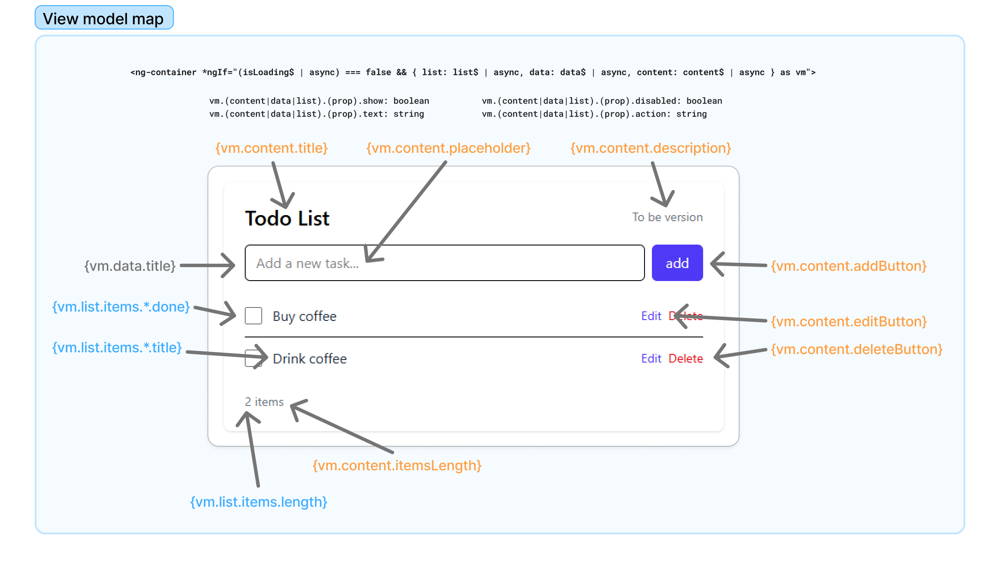
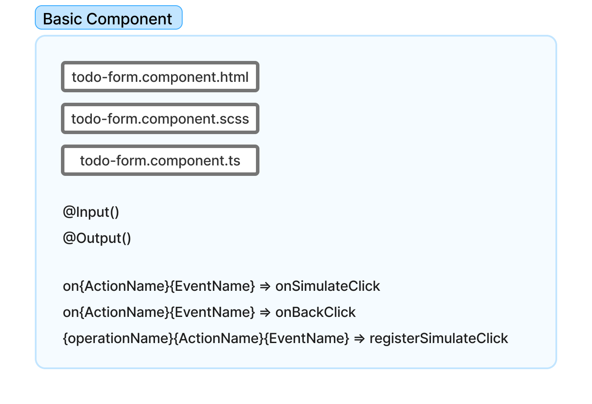
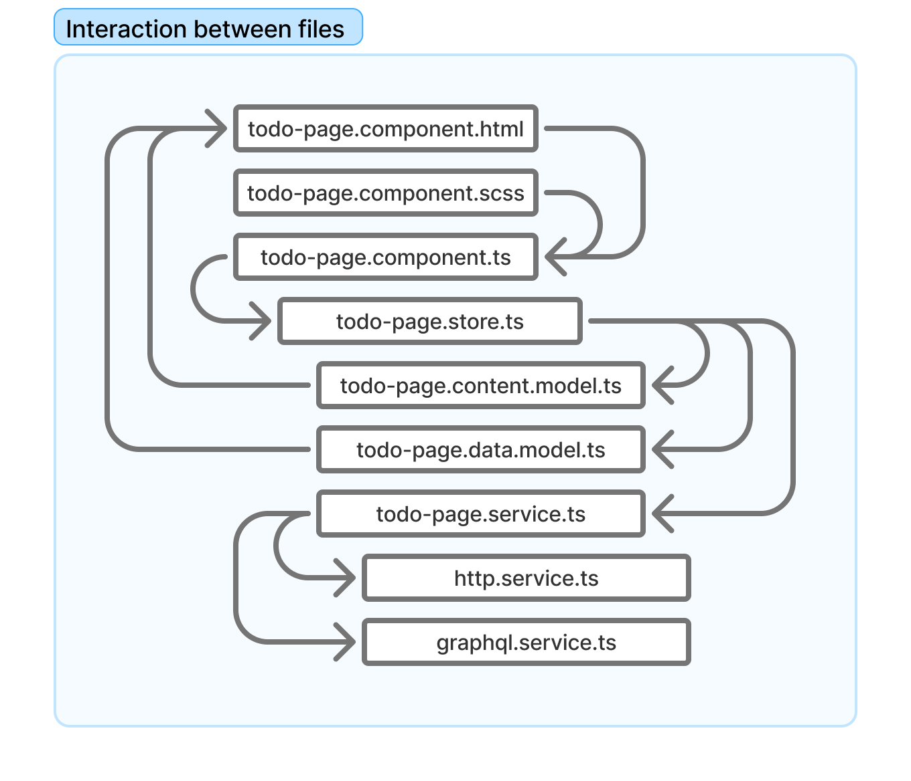

# STRUCTURE

## Example of a map from the visualization model



## Basic Component



Basic components should interact with parent components only through `@Input()` and `@Output()`.

```ts
@Component({
  standalone: true,
  selector: 'lib-loader',
  templateUrl: './loader.component.html',
  styleUrls: ['./loader.component.css'],
  imports: [CommonModule],
})
export class LoaderComponent {
  @Input() visible = false;
}
```

## Page Component

The page components must follow the data and content of the view model.




### File `todo-page.component.html`

```html
<div class="center">
  <lib-loader [visible]="isLoading$ | async"></lib-loader>
</div>

<ng-container
  *ngIf="
    (isLoading$ | async) === false && {
      list: list$ | async,
      data: data$ | async,
      content: content$ | async,
    } as vm
  "
>
  <!-- Example -->
  <h1 *ngIf="vm.content.title.show">
    {{ vm.content.title.text }}
  </h1>
  <!-- Example -->
... your html content here

</ng-container>
```

### File `todo-page.component.ts`

- **Item 1:** To access the `store`, extend the corresponding base class.
- **Item 2:** Implement the `OnInit` event to initialize the `store`.
- **Item 3:** Inject the `store` into the `constructor` with `protected override`.
- **Item 4:** Init the `store`
- **Item 5:** Update the `store` with the filled-in data.

```ts
@Component({
  standalone: true,
  selector: 'app-todo-page',
  templateUrl: 'todo-page.component.html',
  styleUrls: ['todo-page.component.scss'],
  imports: [CommonModule, FormsModule, ReactiveFormsModule],
  providers: [TodoPageStore],
})
export class TodoPageComponent
  extends BaseListComponent<TodoPageStore> /* Item 1 */
  implements OnInit /* Item 2 */
{
  form!: FormGroup;

  constructor(
    protected override store: TodoPageStore, /* Item 3 */
    private formBuilder: FormBuilder,
  ) {
    super();
  }

  ngOnInit(): void {
    this.store.init(); /* Item 4 */
    this.createForm();
  }

  createForm() {
    this.form = this.formBuilder.group({
      itemTitle: [this.store.data.title, [Validators.required]],
    });
    this.form.valueChanges.subscribe(() => {
      this.debouncedUpdate(); /* Item 5 */
    });
  }

  private debouncedUpdate = debounce(() => {
    this.store.updateData({ title: this.form.value.itemTitle });
  });

  // ## EVENTS ####################################################

  - click
  - emit
  - register
}
```
