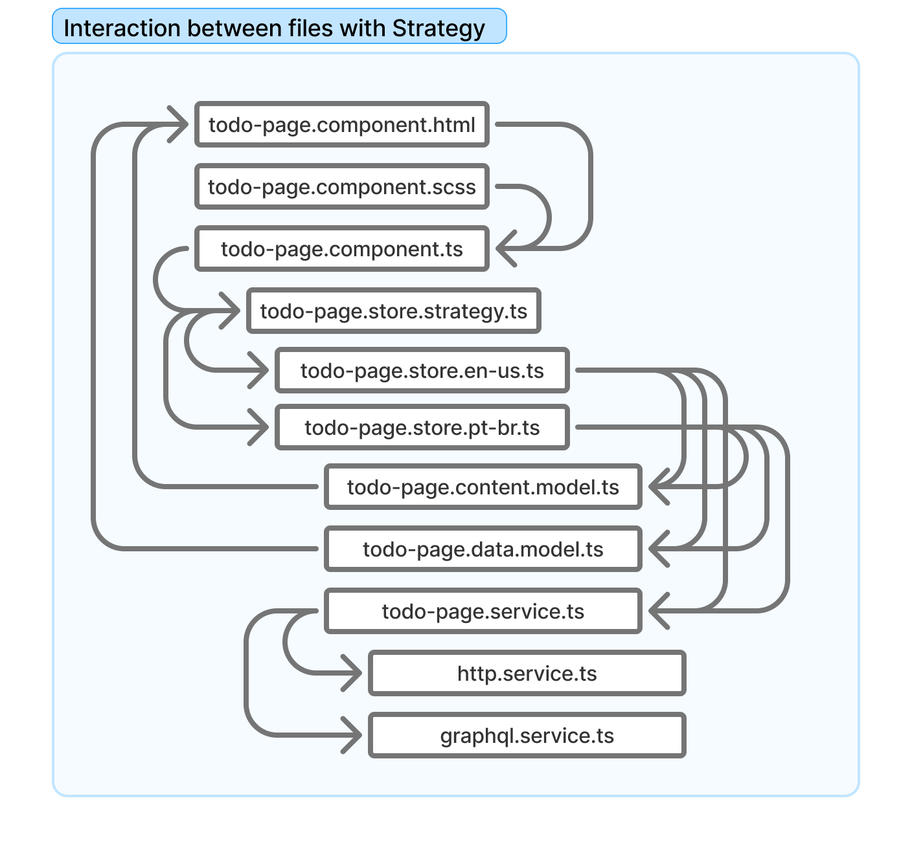

# STRUCTURE

## Example of a map from the visualization model


## Basic Component


Basic components should interact with parent components only through `@Input()` and `@Output()`.

```ts
@Component({
  standalone: true,
  selector: 'lib-loader',
  templateUrl: './loader.component.html',
  styleUrls: ['./loader.component.css'],
  imports: [CommonModule],
})
export class LoaderComponent {
  @Input() visible = false;
}
```

## Page Component

The page components must follow the data and content of the view model.





### File `todo-page.component.html`

```html
<div class="center">
  <lib-loader [visible]="isLoading$ | async"></lib-loader>
</div>

<ng-container
  *ngIf="
    (isLoading$ | async) === false && {
      list: list$ | async,
      data: data$ | async,
      content: content$ | async,
    } as vm
  "
>
  <!-- Example -->
  <h1 *ngIf="vm.content.title.show">
    {{ vm.content.title.text }}
  </h1>
  <!-- Example -->
... your html content here

</ng-container>
```

### File `todo-page.component.ts`

- **Item 1:** To access the `store`, extend the corresponding base class.
- **Item 2:** Implement the `OnInit` event to initialize the `store`.
- **Item 3:** Pass the `store` to base component.
- **Item 4:** Init the `store`
- **Item 5:** Update the `store` with the filled-in data.

```ts
@Component({
  standalone: true,
  selector: 'app-todo-page',
  templateUrl: 'todo-page.component.html',
  styleUrls: ['todo-page.component.scss'],
  imports: [CommonModule, FormsModule, ReactiveFormsModule],
  providers: [TodoPageStore],
})
export class TodoPageComponent
  extends BaseListComponent<TodoPageStore> /* Item 1 */
  implements OnInit /* Item 2 */
{
  form!: FormGroup;

  constructor(
    private formBuilder: FormBuilder,
  ) {
    super(TodoPageStore); /* Item 3 */
  }

  ngOnInit(): void {
    this.store.init(); /* Item 4 */
    this.createForm();
  }

  createForm() {
    this.form = this.formBuilder.group({
      itemTitle: [this.store.data.title, [Validators.required]],
    });
    this.form.valueChanges.subscribe(() => {
      this.debouncedUpdate(); /* Item 5 */
    });
  }

  private debouncedUpdate = debounce(() => {
    this.store.updateData({ title: this.form.value.itemTitle });
  });

  // ## EVENTS ####################################################

  - click
  - emit
  - register
}
```

## Page Component with strategy

```ts
import { InjectionToken, Provider } from '@angular/core';

import { Observable } from 'rxjs';
import { TodoPageData } from '../todo-page.data.model';
import { TodoPageEnUsStore } from './todo-page.store-en-us';
import { TodoPagePtBrStore } from './todo-page.store.pt-br';

export interface TodoPageStoreStrategy {
  content$: Observable<any>;
  data$: Observable<any>;
  data: any;
  updateData(data: Partial<TodoPageData>): void;
  list$: Observable<any>;
  isLoading$: Observable<any>;
  init(): void;
  addTodo(input: { title: string }): void;
  getTodo(index: number): TodoPageData | undefined;
  updateTitle(index: number, updated: TodoPageData): void;
  toggleDone(index: number): void;
  newItem(): void;
  remove(index: number): void;
}

export const TODO_STRATEGIES = new InjectionToken<Record<string, TodoPageStoreStrategy>>(
  'TODO_STORE_STRATEGIES',
);

export const TodoStrategyProvider: Provider = {
  provide: TODO_STRATEGIES,
  useFactory: (ptBR: TodoPagePtBrStore, enUS: TodoPageEnUsStore) => ({
    ptBR,
    enUS,
  }),
  deps: [TodoPagePtBrStore, TodoPageEnUsStore],
};
```

### File `todo-page.component.ts` (with strategy)

```ts
@Component({
  standalone: true,
  selector: 'app-todo-page',
  templateUrl: 'todo-page.component.html',
  styleUrls: ['todo-page.component.scss'],
  imports: [CommonModule, FormsModule, ReactiveFormsModule, LoaderComponent],
  providers: [TodoPageEnUsStore, TodoPagePtBrStore, TodoStrategyProvider],
})
export class TodoPageComponent
  extends BaseListComponent<TodoPageStore> /* Item 1 */
  implements OnInit /* Item 2 */
{
  form!: FormGroup;

  constructor(
    @Inject(TODO_STRATEGIES) strategies: Record<string, TodoPageStoreStrategy>, /* Item 3 */
    private libraryStore: LibraryStore,
    private formBuilder: FormBuilder,
  ) {
    super(strategies as Record<string, TodoPageEnUsStore>, true);
    this.resolveStrategy(this.libraryStore.current.lang);
  }

  ngOnInit(): void {
    this.store.init(); /* Item 4 */
    this.createForm();
  }

  createForm() {
    this.form = this.formBuilder.group({
      itemTitle: [this.store.data.title, [Validators.required]],
    });
    this.form.valueChanges.subscribe(() => {
      this.debouncedUpdate(); /* Item 5 */
    });
  }

  private debouncedUpdate = debounce(() => {
    this.store.updateData({ title: this.form.value.itemTitle });
  });

  // ## EVENTS ####################################################

  - click
  - emit
  - register
}
```
